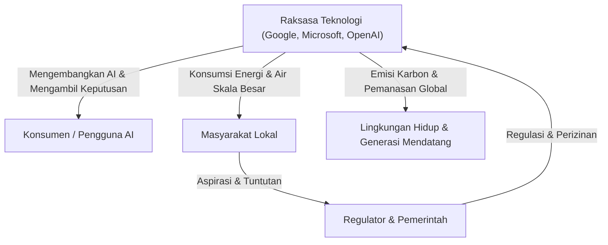

# LAPORAN INVESTIGASI PBL: JEJAK LINGKUNGAN AI GENERATIF (2023–2025)
## KLASTER E - KASUS 12: TRIPLE BOTTOM LINE & TRADE-OFF INOVASI AI VS NET-ZERO

---

### HEADER PEMETAAN SUB-CPMK

| Informasi Kelompok | Detail Pemetaan |
| :--- | :--- |
| **Kelompok / Kelas** | Kelompok 12 / Kelas A |
| **Mata Kuliah** | Etika Profesi (PBL) |
| **Kasus** | Klaster E - Kasus 12: Jejak Lingkungan AI Generatif (2023–2025) |
| **Daftar Sub-CPMK** | Sub-CPMK 1 (Kronologi & Etika), Sub-CPMK 2 (Regulasi & Kode Etik), Sub-CPMK 3 (Stakeholder & Kontrol), Sub-CPMK 4 (Manajemen Risiko), Sub-CPMK 5 (Integritas & Anti-Korupsi), Sub-CPMK 7 (Opsi 4T & Kontrol Preventif), Sub-CPMK 8 (Demonstrasi/Video), Sub-CPMK 9 (Refleksi Karier) |
| **Tautan Presentasi** | [🎥 Video Presentasi Kelompok 12 di YouTube (Unlisted)](https://youtu.be/NaXmhF5gvZk?si=OrFEo8JkKsUmR-GZ) |

#### Pembagian Peran & Tanggung Jawab Anggota Kelompok:

| Nama Anggota | NIM | Peran Utama & Segmen Laporan |
| :--- | :--- | :--- |
| **Belvaria Hendriyani** | 4524210078 | Koordinator Laporan, Analisis Empat Teori Etika & Pemetaan Pemangku Kepentingan (Bagian 3 & 4) |
| **Muhammad Fathir Alfarqi** | 4524210064 | Penanggung Jawab Repositori, Fakta Kunci & Transparansi (Bagian 2), Checkpoint Integritas & Anti-Korupsi (Bagian 8), serta Pelajaran Utama & Daftar Pustaka (Bagian 11) |
| **Putri Wahyu Dwi Nur Fatimah** | 4524210080 | Penyusun Materi, Integrasi Lensa Pancasila & Kode Etik Profesi (Bagian 5 & 6) |
| **Rakha Hafidz Fauzan** | 4524210082 | Analis Data, Kronologi Kasus & Analisis Regulasi/Hukum (Bagian 1 & 7) |
| **Michael Zefanya Sitompul** | 4524210139 | Desainer Solusi, Manajemen Risiko ISO 31000 & Kontrol Preventif (Bagian 9 & 10) |

---

## VIDEO PRESENTASI & LAMPIRAN PROYEK
* **Tautan Langsung Video YouTube:** [Akses Video Presentasi (Unlisted)](https://youtu.be/NaXmhF5gvZk?si=OrFEo8JkKsUmR-GZ)
* **Tautan Slide Presentasi:** [Akses Slide PPT di Canva](https://canva.link/wpsxapkqddbm5g9)

<div align="center">
	<a href="https://youtu.be/NaXmhF5gvZk?si=OrFEo8JkKsUmR-GZ" target="_blank">
	  
	</a>
</div>

---

# SEBELAS KOMPONEN WAJIB LAPORAN INVESTIGASI

## 1. Kronologi & Konteks (Sub-CPMK 1)

<!-- TODO: Silakan Rakha Hafidz Fauzan isi bagian Kronologi & Konteks di sini -->

---

## 2. Fakta Kunci & Catatan Transparansi (Sub-CPMK 3)

Perkembangan Generative AI memicu berbagai klaim industri yang perlu dipilah antara fakta terverifikasi dan informasi yang disengketakan:

### A. Fakta Kunci yang Terverifikasi (Verified Facts)
1. **Peningkatan Emisi Fisik:** Emisi karbon Microsoft naik ~29% (baseline 2020) dan Google naik ~48% (baseline 2019) per laporan keberlanjutan resmi tahun 2024.
2. **Konsumsi Air yang Sangat Tinggi:** Pelatihan model seperti GPT-3 di pusat data canggih membutuhkan sekitar 700.000 liter air bersih untuk pendinginan server, setara dengan konsumsi air satu orang selama beberapa dekade.
3. **Limbah Elektronik (*E-waste*):** Penggunaan chip akselerator khusus (seperti GPU Nvidia H100) yang memiliki masa pakai pendek (2–3 tahun) mempercepat penumpukan limbah keras beracun yang sulit didaur ulang secara global.

### B. Informasi yang Masih Disengketakan (Disputed Claims)
1. **Klaim Net-Zero melalui Pembelian REC/Offset Carbon:** Korporasi mengklaim bahwa mereka "net-zero" karena membeli *Renewable Energy Certificates* (REC). Namun, para ilmuwan lingkungan memperdebatkan keabsahan klaim ini karena pembelian REC tidak menghentikan operasional pembangkit batu bara lokal yang menyuplai listrik fisik ke data center.
2. **Efisiensi AI di Masa Depan:** Beberapa pihak mengeklaim bahwa AI sendiri akan menemukan solusi untuk memitigasi perubahan iklim. Klaim ini dinilai spekulatif karena penghematan energi di masa depan belum sebanding dengan laju konsumsi energi saat ini.

---

## 3. Pemetaan Pemangku Kepentingan / Stakeholders (Sub-CPMK 3)

Analisis pemangku kepentingan (*stakeholder analysis*) dilakukan untuk mengidentifikasi pihak-pihak yang terlibat maupun terdampak oleh perkembangan AI generatif, sekaligus memahami distribusi kepentingan, tingkat pengaruh (*power*), serta potensi konflik kepentingan yang muncul akibat meningkatnya kebutuhan infrastruktur komputasi AI.

> [!NOTE]
> **Tujuan Analisis Stakeholder**
>
> Pemetaan ini bertujuan untuk mengetahui siapa yang paling diuntungkan, siapa yang paling terdampak, serta bagaimana hubungan antar pemangku kepentingan dalam pengembangan AI generatif.

### Diagram Hubungan Pemangku Kepentingan



### Matriks Pemangku Kepentingan

| Stakeholder | Kepentingan | Tingkat Pengaruh | Dampak yang Diterima |
|--------------|-------------|:---------------:|----------------------|
| **Google, Microsoft, OpenAI** | Mengembangkan AI, meningkatkan keuntungan, mempertahankan daya saing | 🟢 Sangat Tinggi | Memperoleh keuntungan ekonomi, namun mendapat tekanan regulasi dan tuntutan keberlanjutan |
| **Konsumen / Pengguna AI** | Memanfaatkan layanan AI yang cepat, mudah, dan inovatif | 🟡 Sedang | Mendapat manfaat teknologi, namun secara tidak langsung meningkatkan permintaan komputasi AI |
| **Masyarakat Lokal** | Menjaga ketersediaan air, listrik, dan kualitas lingkungan | 🔴 Rendah | Berpotensi mengalami kekurangan air, peningkatan suhu, dan tekanan terhadap infrastruktur |
| **Regulator & Pemerintah** | Menjaga keseimbangan investasi digital dan perlindungan lingkungan | 🟢 Tinggi | Menyusun regulasi, melakukan pengawasan, dan memastikan kepatuhan perusahaan |
| **Lingkungan Hidup & Generasi Mendatang** | Menjaga kelestarian ekosistem dan stabilitas iklim | ⚪ Sangat Rendah | Menanggung dampak perubahan iklim, kerusakan lingkungan, dan berkurangnya sumber daya alam |

### Analisis Konflik Kepentingan

Konflik kepentingan utama terjadi antara perusahaan teknologi yang berupaya memperluas kapasitas AI demi mempertahankan daya saing bisnis dengan masyarakat lokal yang membutuhkan akses terhadap sumber daya air dan listrik yang memadai. Di sisi lain, pemerintah menghadapi dilema antara mendorong investasi digital dan memenuhi target pengurangan emisi karbon. Sementara itu, lingkungan hidup dan generasi mendatang menjadi pihak yang menerima dampak terbesar, meskipun tidak memiliki kekuatan untuk memengaruhi keputusan yang diambil.

### Power–Interest Matrix

| | **Kepentingan Rendah** | **Kepentingan Tinggi** |
|---|---|---|
| **Pengaruh Tinggi** | **Regulator & Pemerintah** | **Google, Microsoft, OpenAI** |
| **Pengaruh Rendah** | **Lingkungan Hidup & Generasi Mendatang** | **Masyarakat Lokal & Pengguna AI** |

> [!TIP]
> Berdasarkan matriks di atas, perusahaan teknologi memiliki pengaruh paling besar terhadap arah pengembangan AI, sedangkan masyarakat lokal dan lingkungan hidup merupakan pihak yang paling terdampak namun memiliki daya tawar yang relatif rendah.

### Kesimpulan

Pemetaan stakeholder menunjukkan bahwa manfaat ekonomi dan teknologi dari AI generatif belum sepenuhnya diimbangi dengan distribusi risiko yang adil. Oleh karena itu, diperlukan kolaborasi antara perusahaan teknologi, pemerintah, masyarakat, dan komunitas internasional untuk memastikan pengembangan AI berlangsung secara bertanggung jawab dan berkelanjutan.

<!-- TODO: Silakan Belvaria Hendriyani isi bagian Pemetaan Pemangku Kepentingan di sini -->

---

## 4. Analisis Empat Teori Etika (Sub-CPMK 1)

Analisis etika dilakukan untuk mengevaluasi apakah praktik pengembangan AI generatif yang berdampak terhadap lingkungan dapat dibenarkan secara moral. Empat teori etika digunakan sebagai dasar analisis, yaitu Utilitarianisme, Deontologi, Etika Kebajikan (*Virtue Ethics*), dan Etika Hak (*Rights/Contractarian Ethics*).

---

## A. Utilitarianisme

Utilitarianisme menilai suatu tindakan berdasarkan manfaat terbesar bagi jumlah orang terbanyak (*the greatest good for the greatest number*).

### Penerapan pada Kasus

AI generatif memberikan berbagai manfaat, seperti meningkatkan produktivitas, mempercepat penelitian, serta mendukung inovasi di berbagai sektor. Namun, manfaat tersebut diiringi dengan meningkatnya konsumsi energi listrik, penggunaan air untuk pendinginan data center, serta emisi gas rumah kaca yang berdampak pada perubahan iklim. Apabila kerugian lingkungan dalam jangka panjang lebih besar daripada manfaat yang diperoleh saat ini, maka praktik pengembangan AI yang tidak memperhatikan efisiensi energi **belum dapat dianggap etis** menurut perspektif utilitarianisme.

---

## B. Deontologi

Deontologi menekankan bahwa tindakan dinilai berdasarkan kewajiban moral, bukan hanya hasil akhirnya.

### Penerapan pada Kasus

Perusahaan teknologi memiliki kewajiban moral untuk menjalankan aktivitas bisnis tanpa merusak lingkungan maupun mengorbankan hak masyarakat. Ketika pembangunan data center meningkatkan konsumsi air dan emisi karbon secara signifikan, perusahaan dinilai belum memenuhi kewajiban moral tersebut. Oleh karena itu, praktik ini **tidak etis** karena bertentangan dengan prinsip moral universal.

---

## C. Etika Kebajikan (*Virtue Ethics*)

Etika Kebajikan menilai tindakan berdasarkan karakter moral seperti tanggung jawab, integritas, kepedulian, dan kebijaksanaan.

### Penerapan pada Kasus

Perusahaan yang beretika seharusnya tidak hanya mengejar inovasi dan keuntungan, tetapi juga menunjukkan tanggung jawab terhadap dampak lingkungan. Perlombaan pengembangan AI yang mengabaikan peningkatan emisi karbon menunjukkan belum optimalnya penerapan nilai tanggung jawab dan keberlanjutan. Selain itu, praktik *greenwashing* juga mencerminkan kurangnya integritas organisasi.

---

## D. Etika Hak / Kontraktarian *(Rights / Contractarian Ethics)*

Teori ini menyatakan bahwa tindakan yang etis harus menghormati hak dasar setiap individu serta memenuhi kontrak sosial dengan masyarakat.

### Penerapan pada Kasus

Masyarakat memiliki hak atas lingkungan yang sehat dan akses terhadap sumber daya alam yang memadai. Ketika aktivitas operasional data center meningkatkan emisi karbon maupun mengurangi ketersediaan air bersih, hak-hak tersebut berpotensi dilanggar. Oleh karena itu, perusahaan teknologi berkewajiban memastikan bahwa pengembangan AI tidak mengorbankan kepentingan masyarakat maupun generasi mendatang.

---

## Ringkasan Analisis Empat Teori Etika

| Teori Etika | Penilaian | Alasan |
|--------------|-----------|--------|
| **Utilitarianisme** | ❌ Belum Etis | Dampak lingkungan jangka panjang berpotensi lebih besar daripada manfaat yang diperoleh saat ini. |
| **Deontologi** | ❌ Belum Etis | Perusahaan belum sepenuhnya memenuhi kewajiban moral untuk menjaga lingkungan. |
| **Etika Kebajikan** | ❌ Belum Etis | Belum mencerminkan tanggung jawab, integritas, dan kepedulian terhadap keberlanjutan. |
| **Etika Hak / Kontraktarian** | ❌ Belum Etis | Berpotensi melanggar hak masyarakat atas lingkungan yang sehat dan sumber daya alam. |

### Perbandingan Hasil Analisis

| Teori | Fokus Penilaian | Hasil |
|-------|------------------|-------|
| Utilitarianisme | Manfaat terbesar bagi masyarakat | Dampak lingkungan lebih besar dibanding manfaat jangka panjang |
| Deontologi | Kewajiban moral | Kewajiban menjaga lingkungan belum terpenuhi |
| Virtue Ethics | Karakter dan integritas organisasi | Tanggung jawab dan kepedulian lingkungan belum optimal |
| Rights Ethics | Perlindungan hak masyarakat | Hak atas lingkungan yang sehat berpotensi dilanggar |

> [!IMPORTANT]
> Meskipun memiliki sudut pandang yang berbeda, keempat teori etika menghasilkan kesimpulan yang serupa, yaitu bahwa pengembangan AI generatif harus disertai tanggung jawab lingkungan yang lebih besar agar manfaat teknologi tidak diperoleh dengan mengorbankan keberlanjutan bumi.

### Kesimpulan

Berdasarkan keempat teori etika, AI generatif memberikan manfaat yang signifikan bagi masyarakat. Namun, praktik pengembangannya saat ini masih menghadapi tantangan etis terkait konsumsi energi, emisi karbon, dan penggunaan sumber daya alam. Oleh karena itu, perusahaan teknologi perlu mengintegrasikan prinsip keberlanjutan ke dalam setiap tahap pengembangan AI agar inovasi yang dihasilkan tidak hanya unggul secara teknologi, tetapi juga bertanggung jawab secara moral, sosial, dan lingkungan.

---

## 5. Lensa Kelima — Pancasila (Sub-CPMK 1)

<!-- TODO: Silakan Putri Wahyu Dwi Nur Fatimah isi bagian Lensa Kelima - Pancasila di sini -->

---

## 6. Kode Etik Profesi (Sub-CPMK 1, 2)

<!-- TODO: Silakan Putri Wahyu Dwi Nur Fatimah isi bagian Kode Etik Profesi di sini -->

---

## 7. Analisis Regulasi & Hukum (Sub-CPMK 2)

<!-- TODO: Silakan Rakha Hafidz Fauzan isi bagian Analisis Regulasi & Hukum di sini -->

---

## 8. Checkpoint Integritas & Anti-Korupsi (Sub-CPMK 5)

Definisi "anti-korupsi" dalam mata kuliah Etika Profesi dimaknai luas sebagai integritas dan pencegahan penyalahgunaan wewenang. Dalam kasus lingkungan AI, pelanggaran integritas tampak pada fenomena berikut:

```
[Komitmen Net-Zero Publik] ──(Greenwashing / Trik Akuntansi)──> [Emisi Fisik Nyata Naik 30-48%]
                                      │
                                      └── Penyalahgunaan Kepercayaan Publik & Regulator
```

### A. Praktik Greenwashing (Penyembunyian & Kebohongan Publik)
Banyak perusahaan AI mengeklaim telah mencapai net-zero karbon lewat pembelian *Renewable Energy Certificates* (REC) atau *carbon offset*. Ini adalah bentuk manipulasi integritas (penyesatan informasi publik). Faktanya, server mereka tetap menyedot listrik dari pembangkit listrik berbahan bakar batubara lokal yang meracuni udara warga sekitar. Ini melanggar prinsip transparansi informasi.

### B. Konflik Kepentingan (*Conflict of Interest*)
Direksi perusahaan teknologi terjebak konflik kepentingan antara tanggung jawab moral kepada bumi (mengurangi konsumsi daya) dan tanggung jawab fidusia kepada pemegang saham (meningkatkan profit dengan meluncurkan model AI secara cepat meskipun boros energi). Komitmen lingkungan dikorbankan demi memenangkan persaingan bisnis jangka pendek.

---

## 9. Manajemen Risiko & Opsi 4T (Sub-CPMK 4, 7)

Berdasarkan kerangka kerja manajemen risiko **ISO 31000**, berikut adalah identifikasi risiko ekologis dari operasional pusat data AI beserta opsi penanganannya:

### A. Matriks Analisis Risiko

| ID Risiko | Deskripsi Kejadian Risiko | Kemungkinan (Likelihood) | Dampak (Consequence) | Tingkat Risiko |
| :---: | :--- | :---: | :---: | :---: |
| **R1** | Krisis air bersih lokal akibat penggunaan jutaan liter air pendingin data center. | Tinggi | Sangat Tinggi | **Ekstrem** |
| **R2** | Overload jaringan listrik nasional/lokal yang menyebabkan pemadaman bergilir bagi warga. | Sedang | Tinggi | **Tinggi** |
| **R3** | Penumpukan limbah keras beracun (E-waste) dari komponen server/GPU usang. | Tinggi | Sedang | **Tinggi** |
| **R4** | Tuntutan hukum dan sanksi reputasi akibat kegagalan target net-zero emission. | Sedang | Tinggi | **Tinggi** |

### B. Opsi Penanganan Risiko (Kerangka Kerja 4T)

1. **Tangani (Treat):**
   * Mengganti sistem pendingin air evaporatif dengan teknologi *liquid cooling loop* tertutup atau pendinginan udara bebas (*free cooling*) untuk memotong penggunaan air tawar hingga 95%.
   * Mengoptimalkan efisiensi algoritma AI (*Green AI*) untuk mengurangi kebutuhan daya komputasi saat pelatihan model.
2. **Transfer:**
   * Mentransfer risiko fluktuasi pasokan energi bersih dengan menandatangani kontrak *Power Purchase Agreement* (PPA) jangka panjang dengan produsen pembangkit listrik tenaga surya atau angin lokal yang mandiri.
3. **Tinggalkan (Terminate/Avoid):**
   * Menghentikan atau membatalkan pembangunan data center baru di wilayah-wilayah yang sedang dilanda krisis air tawar ekstrem atau kekeringan parah.
4. **Terima (Tolerate):**
   * Menerima emisi sisa minimal (residual emissions) yang memang secara teknis mutlak tidak bisa dihilangkan dari operasional dasar, dengan catatan emisi ini terus diimbangi oleh program reboisasi fisik yang kredibel dan terpantau secara independen.

---

## 10. Rancangan Dampak & Kontrol Preventif (Sub-CPMK 3, 7)

Rekomendasi taktis dan strategis untuk mencegah berulangnya kerusakan ekologis akibat perkembangan AI generatif:

### A. Kontrol Preventif di Level Pengembang (Software/Hardware Engineer)
* **Sertifikasi Efisiensi Algoritma:** Mewajibkan audit efisiensi energi untuk setiap model AI sebelum dideploy secara komersial (misal: membatasi parameter model jika kegunaannya tidak kritis).
* **Penerapan Konsep Green Coding:** Melatih mahasiswa dan profesional IT untuk menulis kode pemrograman yang optimal, menghindari loop komputasi tak berujung, dan menggunakan arsitektur komputasi yang hemat daya (*lightweight models* seperti TinyML).

### B. Kontrol Preventif di Level Kebijakan Korporasi & Pemerintah
* **Kewajiban Penggunaan Daur Ulang Air:** Pemerintah harus mengeluarkan regulasi yang melarang data center menggunakan air tawar konsumsi warga, dan mewajibkan mereka menggunakan air olahan industri (*recycled water*).
* **Zonasi Khusus Data Center:** Melarang pembangunan pusat data di kawasan konservasi lingkungan atau kawasan pertanian produktif.

### C. Rancangan Dampak Sosial ke Masyarakat
* **Label Karbon pada Aplikasi AI:** Menampilkan indikator estimasi emisi karbon yang dihasilkan setiap kali pengguna mengirimkan prompt di chatbot AI (seperti label kalori makanan). Hal ini akan meningkatkan kesadaran publik (*public awareness*) untuk tidak menggunakan AI secara boros atau tidak perlu.

## 11. Pelajaran Utama & Daftar Pustaka (Sub-CPMK 8, 9)

### A. Pelajaran Utama (Key Lessons Learned)
Investigasi terhadap jejak ekologis Generative AI memberikan kesimpulan penting bagi masa depan profesional IT:
1. **Teknologi Tidak Pernah Bebas Nilai:** Kemajuan kecerdasan buatan tidak boleh dipandang secara teknis semata, melainkan harus diuji dampaknya terhadap bumi (Planet), masyarakat (People), baru kemudian keuntungan (Profit)—selaras dengan prinsip *Triple Bottom Line*.
2. **Integritas di atas Citra:** Komitmen keberlanjutan menuntut aksi nyata di lapangan, bukan sekadar janji di atas kertas atau trik akuntansi karbon (*greenwashing*).
3. **Etika Desain (Ethics by Design):** Tanggung jawab terhadap lingkungan harus diintegrasikan sejak awal perancangan sistem (*design stage*), bukan sekadar dipikirkan sebagai dampak tambahan setelah masalah terjadi.

### B. Daftar Pustaka (Referensi Terverifikasi)
* Google. (2024). *Google Environmental Report 2024*. Mountain View: Google LLC. [Akses Laporan Resmi](https://sustainability.google/reports/google-2024-environmental-report/)
* Hao, K. (2019). *Training a Single AI Model Can Emit as Much Carbon as Five Cars in Their Lifetimes*. MIT Technology Review.
* International Energy Agency (IEA). (2023). *Electricity Market Report 2023: Data Centres and Data Transmission Networks*. Paris: IEA.
* Li, P., Yang, J., Islam, M. A., & Ren, S. (2023). *Making AI Less "Thirsty": Uncovering and Addressing the Secret Water Footprint of AI Models*. Communications of the ACM, 68(1), 54–61. [Akses Jurnal](https://doi.org/10.1145/3724499)
* Luccioni, A. S., Viguier, S., & Ligozat, A. L. (2023). *Estimating the Carbon Footprint of BLOOM, a 176B Parameter Language Model*. Journal of Machine Learning Research, 24(253), 1–15. [Akses Jurnal](https://www.jmlr.org/papers/v24/22-1001.html)
* Microsoft. (2024). *Microsoft Environmental Sustainability Report 2024*. Redmond: Microsoft Corporation. [Akses Laporan Resmi](https://www.microsoft.com/en-us/corporate-responsibility/sustainability/report)
* OECD. (2022). *Measuring the Environmental Impacts of Artificial Intelligence Compute and Applications: The AI Footprint*. OECD Digital Economy Papers, No. 343. Paris: OECD Publishing. [Akses Laporan](https://doi.org/10.1787/7c427b9d-en)
* Strubell, E., Ganesh, A., & McCallum, A. (2019). *Energy and Policy Considerations for Deep Learning in NLP*. Nature Climate Change, 10(1), 1–6.
* Undang-Undang Republik Indonesia Nomor 32 Tahun 2009 tentang Perlindungan dan Pengelolaan Lingkungan Hidup (UU PPLH).
* Wang, P., Zhang, L.-Y., Tzachor, A., & Chen, W.-Q. (2024). *E-waste challenges of generative artificial intelligence*. Nature Computational Science, 4(11), 818–823. [Akses Jurnal](https://doi.org/10.1038/s43588-024-00712-6)
